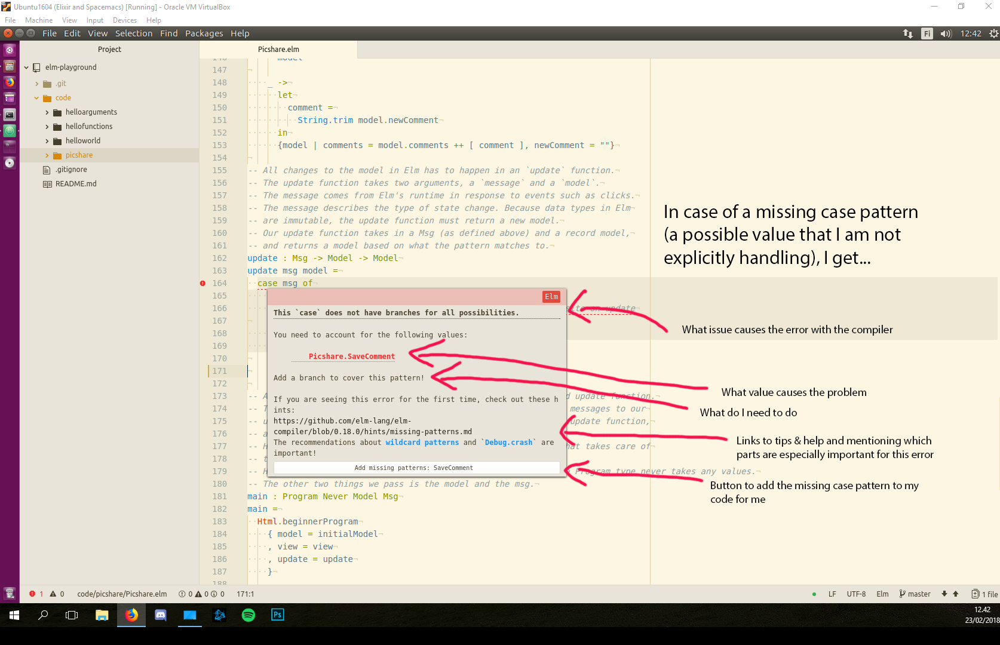

# Elm playground

This repo contains code and notes from my February 2018 learning day about [Elm](http://elm-lang.org/). A learning day is a day-a-month event here at [Evermade](https://www.evermade.fi) where each developer can pick a topic of their interest and spend a full day on learning the technology as they best see fit. The only requirement is that the developer produces enough notes and code to be able to share their learnings onwards to fellow developers and co-workers.

## The picshare app

The end product of this quick dive into Elm is a small web application that fetches JSON data via an API, and also further fetches updates via a WebSocket connection using Elm Subscriptions. Sounds simple, but there's a surprising depth to it in the Elm world! Check out [Picshare.elm](Picshare.elm) for the source code (and comments on why things are done the way they are done), and visit [https://juhalehtonen.github.io/elm-playground/](https://juhalehtonen.github.io/elm-playground/) to see the thing in action. It was compiled with the `--debug` flag to enable time travel debugging (check it out too).

The main application code resides in the root here to create a GitHub Pages site from the Master branch. Other small scale tests are in `code/`.

Based on the excellent [Programming Elm](https://pragprog.com/book/jfelm/programming-elm) book. Compile with `elm make Picshare.elm --output picshare.js`

## What is Elm?

Elm is a functional, statically typed programming language. It is first and foremost intended for producing web front-ends, and so it compiles down to HTML and JavaScript.

What primarily makes Elm stand out from every other JS tool is that the compiler guarantees **no runtime errors in practice**. While you can force the code to produce errors (e.g. by calling `Debug.crash`), in practice you should be able to be certain that if the code compiles, it will not run into errors in your browser.

Other features of Elm include:
- No `null` or `undefined`, everything has to be explicitly handled
- No side effects, which leads to very predictable code
- Immutable data types, further contributing to safety
- Strong static typing, ensuring there are no silly type coercion bugs
- Custom types & pattern matching, allows you to model problems clearly
- Advanced tooling, such as the `time travel debugger`
- Built in framework, known as the `Elm architecture` (aka. Model-View-Update pattern)
- **Great error messages** (see below)

## When would I use Elm?

The most obvious reason to use Elm is if your project requires that the front-end has to be right and it must not crash. Elm is one of the few ways that you can use to make such guarantees and to feel at ease. Obviously this doesn't prevent logic errors by the programmer, but nothing really does.

Additionally, Elm makes it very easy to refactor code fearlessly due to the compile-time guarantees it provides. This means that Elm is also a very good choice for very large web applications that will see lots of iterations over a lifespan of years.

## Who else uses Elm?

While powerful and solving real problems, Elm is not a very popular language. Some reasons for this could be a) that it is built with Haskell so being able to contribute back to the core requires Haskell knowledge, and b) it differs very much from almost every other language in the JavaScript ecosystem, so the initial learning takes longer before developers are proficient at it. And, obviously, the lack of popularity then becomes an argument not to adopt it, further keeping it unpopular.

A quick look at the users of Elm includes names like Prezi, Pivotal (the tracker & others), NoRedInk ([200 000+ lines of production Elm code with a single runtime error due to their own mishap](https://twitter.com/rtfeldman/status/961051166783213570)), and Futurice.

## Drawbacks of Elm

- Writing HTML as functions feels a bit painful at first (but feels nicer when it is separated to small functions)
- Largely a one-man-show with a BDFL (benevolent dictator for life). Keeps things consistent but also locks the language up
- Smallish community and package ecosystem, slow development cycles, limited tooling
- Not popular, smaller pool of developers who already know Elm (although some can argue this makes it EASIER to make good hires)
- Handling outside world resources like JSON via APIs takes more work due to the safety requirements (decoders)
- Interacting with third party JavaScript (not Elm) can be more complicated due to safety requirements (ports)
- More to type & slower prototyping than most dynamic languages (but obviously the up-front work feels less cumbersome in large projects)
- Powerful type system requires lots of thinking, sometimes it hurts my brain a bit :)
